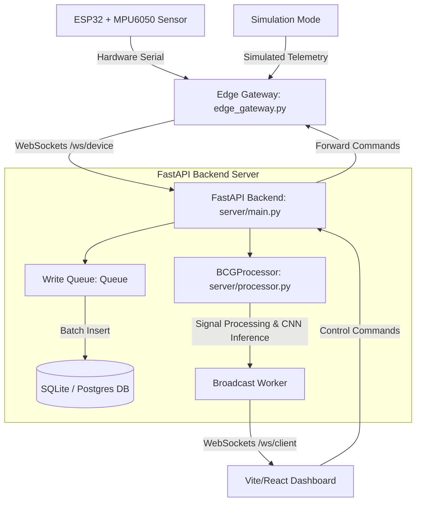

# 🩺 Contactless Ballistocardiography (BCG) Monitoring System

An end-to-end, contactless, accelerometer-based heart-rate (BPM) and Heart Rate Variability (HRV) analysis pipeline, real-time edge gateway, FastAPI backend, and interactive React dashboard. The system processes micro-vibrations captured by an MPU6050 accelerometer connected to an ESP32, and employs a deep learning classifier to predict cardiac rhythm abnormalities.

---

## 🗺️ System Architecture & Data Flow

Below is the high-level architecture showing how telemetry travels from the physical sensor (or simulator) to the persistent database and frontend dashboard.



---

## 🤖 For AI Assistant Agents (Context & System Knowledge)

This section provides quick context for LLM coding assistants modifying or debugging this project.

### 1. Key Component Layout
* **Edge Streamer**: `edge_gateway.py` handles serial port connection at 115200 baud, cleans raw strings, parses data, and pipes it via WebSockets. It also supports simulated bradycardia (`B`), tachycardia (`T`), and normal (`N`) data modes.
* **FastAPI Backend Server**: Located in `/server`.
  * `server/main.py`: Sets up the WebSocket routes (`/ws/device` and `/ws/client`), manages batch database insertions using an asynchronous queue, and broadcasts processed data at 10 Hz.
  * `server/processor.py`: Core signal processing logic. Uses `scipy.signal` to filter noise, detect peaks, compute FFT, and determine signal quality.
  * `server/db.py`: Connects to SQLite (locally as `bcg_telemetry.db`) or PostgreSQL (if `DATABASE_URL` is set).
* **Vite React Frontend**: Located in `/frontend`. Connects to `/ws/client` to render real-time plots, metrics, AI status, and send command overrides.
* **Local Visualization/Simulation Tool**: `bcg_live.py` is a standalone script that runs a local visualizer/plotter for debugging and quick tests.
* **Deep Learning Module**: Located in `/training` and `/inference`.
  * `training/dataset_preparation.py`: Prepares training sets using MIT-BIH recordings.
  * `training/train_cnn.py`: Trains a 1D Convolutional Neural Network.
  * `inference/cnn_inference.py`: Handles model execution.

### 2. Analytical Signal Processing Pipeline
In `server/processor.py`:
1. **Detrending**: Linear trend removal via `scipy.signal.detrend`.
2. **Bandpass Filtering**: 4th-order Butterworth bandpass filter from **0.8 Hz to 4.0 Hz** (cardiac frequency band).
3. **Signal Quality Score (SQS)**: Calculated as:
   $$\text{SQS} = \frac{\text{Cardiac Peak Frequency Magnitude}}{\text{Mean High-frequency Noise Magnitude (4.0–12.0 Hz)} + 1\times 10^{-5}}$$
4. **Channel Selection**: Automatically picks the best physical axis (`ax`, `ay`, `az`) based on the highest SQS score.
5. **Peak Detection**: `scipy.signal.find_peaks` with dynamic prominence ($0.25 \times \sigma$) and minimum distance ($0.22 \times f_s$) for calculating heart rate stability.

---

## 👥 For Users (Installation & Operations)

### 1. Hardware Requirements & Mounting
* **MCU & Sensor**: ESP32 connected to an MPU6050 accelerometer.
* **Firmware settings**:
  * Scale: $\pm 2g$ (`MPU6050_ACCEL_FS_2`) to maximize sensitivity.
  * Low-Pass Filter: 10 Hz or 5 Hz DLPF (`MPU6050_DLPF_BW_10`) to eliminate high-frequency noise.
  * Sampling Rate: Stable **100 Hz** acquisition.
* **Mechanical Mounting**: Mount the sensor **rigidly** to a structural surface (e.g., underneath a seat). Avoid soft cushions.

### 2. Setup & Installation
1. Install Python 3.8+ dependencies:
   ```bash
   pip install -r requirements.txt
   ```
2. Navigate to and set up the Frontend React app:
   ```bash
   cd frontend
   npm install
   ```

### 3. Running the Systems

#### Standalone Post-Hoc Analysis Pipeline
To analyze pre-recorded data in a CSV file:
```bash
python bcg_pipeline.py --input bcg_data.csv --output_dir results/
```

#### Running the Full Stack (Cloud Mode)
1. **Start the FastAPI Backend**:
   ```bash
   python -m server.main
   ```
2. **Start the Edge Gateway** (streams data to server):
   * *Simulation Mode*:
     ```bash
     python edge_gateway.py --mode sim
     ```
   * *Physical Hardware Mode*:
     ```bash
     python edge_gateway.py --mode serial --port COM5 --baud 115200
     ```
3. **Start the Web Dashboard**:
   ```bash
   cd frontend
   npm run dev
   ```

#### Standalone PyQt Local Visualizer
If you do not want to run the web server and web browser:
```bash
# Monitor raw data logging
python bcg_live.py --mode file --file bcg_data.csv --window 10

# Stream from live serial port directly
python bcg_live.py --mode serial --port COM5 --baud 115200 --window 10 --log_file live_bcg_output.csv
```

---

## 💻 For Developers (Extending the Project)

### 1. Database Schema
The database connects to PostgreSQL if the `DATABASE_URL` environment variable is set, otherwise falling back to SQLite (`bcg_telemetry.db`).

#### Telemetry Table (`bcg_telemetry`)
| Column | Type (PostgreSQL / SQLite) | Description |
| :--- | :--- | :--- |
| `id` | SERIAL / INTEGER PRIMARY KEY | Autoincrementing record ID |
| `time_ms` | BIGINT / INTEGER | Device timestamp in milliseconds |
| `ax` | REAL | Raw X-axis accelerometer reading |
| `ay` | REAL | Raw Y-axis accelerometer reading |
| `az` | REAL | Raw Z-axis accelerometer reading |
| `occupancy` | INT / INTEGER | Binary occupancy flag (0 = empty, 1 = occupied) |
| `temp` | REAL | Sensor temperature in °C |
| `humidity`| REAL | Sensor relative humidity in % |
| `created_at` | TIMESTAMP / DATETIME | Server ingestion timestamp |

#### Predictions Table (`ai_predictions`)
| Column | Type (PostgreSQL / SQLite) | Description |
| :--- | :--- | :--- |
| `id` | SERIAL / INTEGER PRIMARY KEY | Autoincrementing prediction ID |
| `time_ms` | BIGINT / INTEGER | Millisecond timestamp of data window |
| `prediction` | VARCHAR(50) / TEXT | Predicted state (`NORMAL`, `BRADYCARDIA`, `TACHYCARDIA`) |
| `confidence` | REAL | Classifier model confidence (0.0 to 1.0) |
| `best_channel` | VARCHAR(10) / TEXT | Accelerometer channel used for the inference |
| `created_at` | TIMESTAMP / DATETIME | Record creation timestamp |

### 2. Deep Learning Classifier Training
The classifier is a 1D CNN trained on the MIT-BIH Arrhythmia Database.

1. **Acquire & Prep Dataset**:
   ```bash
   python training/dataset_preparation.py
   ```
   *Downloads ECG records, segments them into 10-second windows resampled to 100 Hz, filters noise, and exports `X.npy` and `y.npy` to the `/data` folder.*

2. **Train Model**:
   ```bash
   python training/train_cnn.py
   ```
   *Compiles the Conv1D classifier, runs training with Early Stopping, and outputs `/models/cnn_model.keras`.*

### 3. Extending the APIs
New endpoints can be added in `server/main.py`. The WebSockets architecture allows adding custom JSON message types to send parameters down to the gateway, adjust filters dynamically, or flag alert states.
